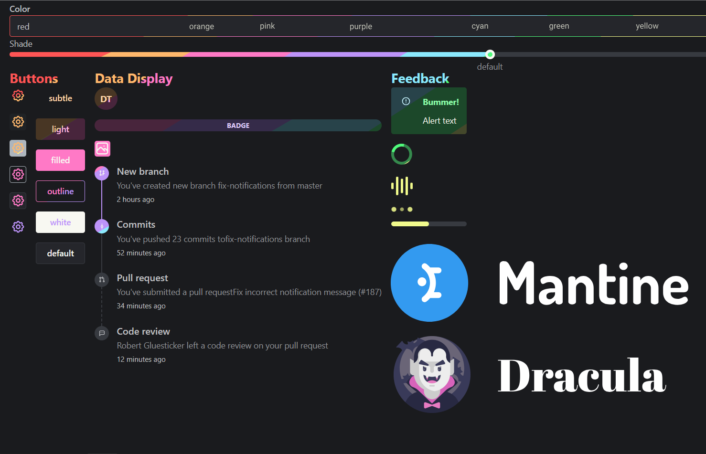

# Dracula for [Mantine](https://mantine.dev/)

> A dark theme for [Mantine](https://mantine.dev/).

You can see a simple [DEMO](https://codesandbox.io/p/sandbox/mantine-dracula-demo-7fzzwp) of the theme

## Install

All instructions can be found at [draculatheme.com/mantine](https://draculatheme.com/mantine).

## Team

This theme is maintained by the following person(s) and a bunch of [awesome contributors](https://github.com/dracula/mantine/graphs/contributors).

|  |
| ---------------------------------------------------------------------------------------- |
| [Kirill Stepkin](https://github.com/zeretkk)                                             |

## Community

- [Twitter](https://twitter.com/draculatheme) - Best for getting updates about themes and new stuff.
- [GitHub](https://github.com/dracula/dracula-theme/discussions) - Best for asking questions and discussing issues.
- [Discord](https://draculatheme.com/discord-invite) - Best for hanging out with the community.

## License

[MIT License](./LICENSE)
